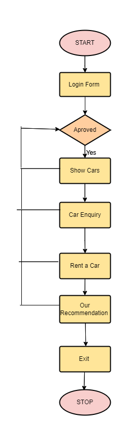
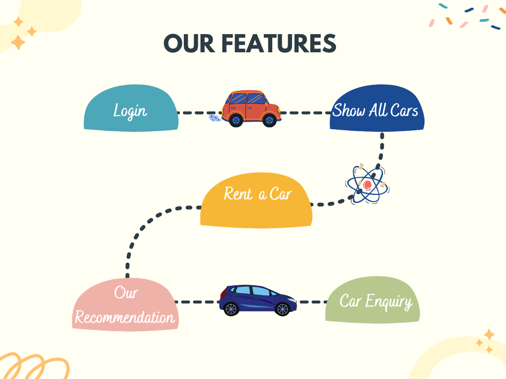

# Car-rental-system
This project is designed to be used by a Car Rental Company specializing in renting 
cars to customers.
It is an online system through which customers can view available cars, register, view 
profile and book a car. Car rental agencies primarily serve people who require a 
temporary vehicle, those who do not own their car, travelers who are out of town, 
or owners of damaged or destroyed vehicles who are awaiting repair or insurance 
compensation.
Alongside the basic rental of a vehicle, car rental agencies typically also offer extra 
products such as insurance, global positioning system (GPS) navigation systems, 
and entertainment systems. People must peregrinate at different places due to their 
official work, family issues, and other major things. If the traveling is of a more 
dominant distance then a person needs a car to peregrinate because it is comfortable 
apart from the other public conveyances consequently people prefer cars rather than 
public conveyances. 

 

Public transport is not very flexible and halcyon like the trains, 
buses, etc. After technological advancement, every family needs a personal conveyance 
for themselves because of the desire to travel to different places far from their 
residence.
The proposed system provides an opportunity to middle-class people who cannot 
afford to buy a car even if they don’t know how to drive. The system provides a driver 
option while charging a minimal amount for equipment.

